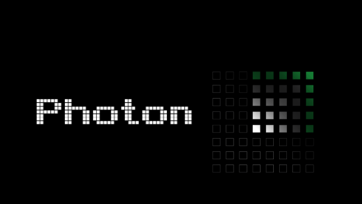

# Photon




Human-in-the-loop layout guidance using computer vision, Grasshopper, and an LED matrix.

---

## What is Photon?

Photon is a hack from the AECtech hackathon exploring how to **guide** people drawing full-scale layouts rather than replacing them with robots.

A camera watches the drawing surface, a Grasshopper backend compares what's being drawn to the digital model, and an LED board gives live feedback – nudging the person doing the layout closer to the target geometry.

Think of it as a tiny, pixelated foreman: _"a bit more to the left… good… stop."_

---

## Motivation

Field layout today is a mix of tape measures, chalk lines, PDFs, and a lot of craft knowledge. Robotic layout systems exist, but they're:

- Expensive  
- Complex to set up and maintain  
- Often overkill for small or bespoke jobs  

Photon asks: **what's the minimum amount of hardware and computation needed to augment a skilled installer, not replace them?**

### Our goals

- Keep the **human in charge** of the drawing tool  
- Provide **simple, legible feedback** (LED pixels instead of another screen of UI)  
- Build a path towards **direct layout from model to jobsite**

---

## How it works (concept)

### 1. Camera capture

A CV camera looks at the drawing surface (wall, slab, panel, etc.). We calibrate it to the physical coordinate system using inexpensive markers.

### 2. Model + tracking in Grasshopper

- The target geometry (lines, points, curves) comes from Rhino/Grasshopper
- The camera feed is processed to detect the live drawing / marker position
- We compute the delta between "where the line should be" and "where the hand actually is"

### 3. LED feedback

A small LED matrix displays simple signals the worker can read without breaking flow:

- Directional hints (left/right/up/down, closer/further)
- "On target" confirmation
- Progress or next target

### 4. Human does the drawing

The worker still pulls the tape, snaps the chalk line, or marks the surface. Photon just quietly steers.

---

## Use cases we're exploring

- 1:1 layouts for custom metal panels and sub-framing  
- On-site transfer of digital patterns for artwork / façade features  
- Training tool for new installers to learn "feel" for complex layouts  
- Interactive installations where the crowd draws and the system guides  

---

## Repo structure (proposed)

```text
.
├── README.md
├── docs/
├── gh/
│   └── photon_controller.gh      # Grasshopper definition(s)
├── cv/
│   └── tracker.py                # computer vision / camera calibration
├── firmware/
│   └── led_driver.ino            # example Arduino / microcontroller sketch
└── config/
    └── demo_config.yaml          # camera + LED + layout parameters
```

> **Note:** Folder names and files are suggestions—adapt to match the actual repo.

---

## Hardware

- CV camera (webcam or industrial camera)
- LED matrix / LED board
- Microcontroller to drive LEDs (e.g. Arduino, ESP32, etc.)
- Laptop running Rhino + Grasshopper
- Tripod / fixture for the camera and board

---

## Software

### Rhino + Grasshopper

Grasshopper plugins for:

- Image / video capture from the camera
- Serial or network I/O to the LED controller
- Computer vision stack (prototype) for tracking lines / markers

### Firmware

Microcontroller firmware to:

- Receive messages from Grasshopper
- Update LED pixels in real time

---

## Running the demo (hackathon flow)

### 1. Set up the scene

- Mount the camera with a clear view of the drawing surface
- Place Photon's LED board where the worker can see it easily

### 2. Calibrate

- Place fiducial markers at known points
- Run the calibration routine to map camera pixels → real-world coordinates

### 3. Load a layout

- Open the Grasshopper file
- Reference a Rhino model / curves that should be drawn 1:1

### 4. Start tracking

- Run the CV script / component to track the marker / pen / chalk line
- Verify that the tracked position aligns with the model in Grasshopper

### 5. Draw with guidance

- As the worker moves, Grasshopper computes the error vector to the nearest target
- That error vector is encoded and sent to the LED board
- The LEDs nudge the worker closer to the intended path

---

## Roadmap / ideas

- Better directional vocab on the LED matrix (arrows, progress bars, error magnitude)
- Richer CV: curve-following, offset lines, recognition of completed segments
- Direct hookups to BIM (Revit, IFC, Speckle) for push-button layout sets
- Multi-user / multi-zone layouts
- Ruggedized hardware for real jobsite conditions

---

## Team

<table>
  <tr>
    <td align="center">
      <br/>
      <b>James Coleman</b><br/>
      Sum Point
    </td>
    <td align="center">
      <br/>
      <b>Sergey Pigach</b><br/>
      CORE Studio
    </td>
    <td align="center">
      <br/>
      <b>Elcin Ertugrul</b><br/>
      CORE Studio
    </td>
  </tr>
  <tr>
    <td align="center">
      <br/>
      <b>Nathan Barnes</b><br/>
      Zahner
    </td>
    <td align="center">
      <br/>
      <b>Polina Ustinova</b><br/>
      Entech
    </td>
    <td align="center">
      <br/>
      <b>Zarak Kasi</b><br/>
      CORE Studio
    </td>
  </tr>
  <tr>
    <td align="center">
      <br/>
      <b>Brian Murray</b><br/>
      Hathaway Dinwiddie
    </td>
    <td align="center">
      <br/>
      <b>Bell Wang</b><br/>
      KPF
    </td>
    <td align="center">
      <br/>
      <b>David Vargas</b><br/>
      DLR Group
    </td>
  </tr>
</table>